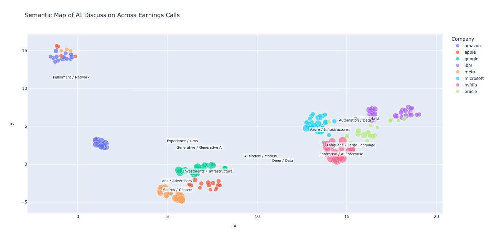

# How Big Tech is Talking About AI: Earnings Call Clustering (2019–2025)

Head over to my [Medium](https://medium.com/@advitis/how-big-tech-is-talking-about-ai-what-earnings-calls-reveal-2019-2025-33ec4b08b289) for a narrative deep-dive of this analysis.

This project analyzes 200+ quarterly earnings calls from major tech companies to uncover how they talk about **Artificial Intelligence** - not through analyst summaries, but using **Natural Language Processing (NLP)** to map their AI narratives directly.

Each dot in the final chart represents an earnings call. Similar calls cluster together based on what was actually said - revealing strategic pivots, converging agendas, and the emergence of generative AI.

---

## 🧠 What This Project Does

### → Goal
Turn six years of text-heavy earnings transcripts into a **semantic map** of AI narratives.

### → Method
1. **Filter** sentences for true AI content (not fluff or legal disclaimers)
2. **Embed** using `sentence-transformers` (MiniLM)
3. **Cluster** with KMeans to detect recurring themes
4. **Name clusters** using cleaned TF-IDF keyword ranking
5. **Aggregate** sentence themes to the earnings-call level
6. **Visualize** with UMAP (dimensionality reduction) + Plotly

---

## 📦 Key Files

| File | Purpose |
|------|---------|
| `scripts/extract_ai_sentences.py` | Filters meaningful AI mentions |
| `scripts/embed_sentences.py` | Runs `SentenceTransformer` encoding |
| `scripts/reduce_and_cluster.py` | UMAP projection + KMeans clustering + cluster labelling |
| `scripts/visualize.py` | Generates final semantic map (with hover + zoom options) |
| `main.py` | Pulls it all together into one pipeline |

---

## 🗺️ Strategic Insight (See Medium article for more detail)

While this repo focuses on implementation, the visual output reveals major trends:

- **Meta** maintains a long-running AI narrative around ad optimization, later branching into generative assistants.
- **Amazon** and **IBM** begin sounding alike in 2023–24 as they push enterprise-grade Gen-AI platforms (Bedrock, Watsonx).
- **Apple** pivots mid-way: from on-device personalization to announcing its “Private Compute Cloud,” returning to an infrastructure narrative.

---
